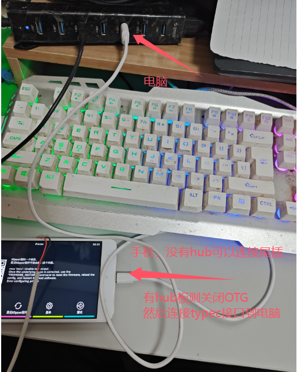
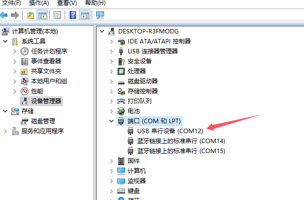
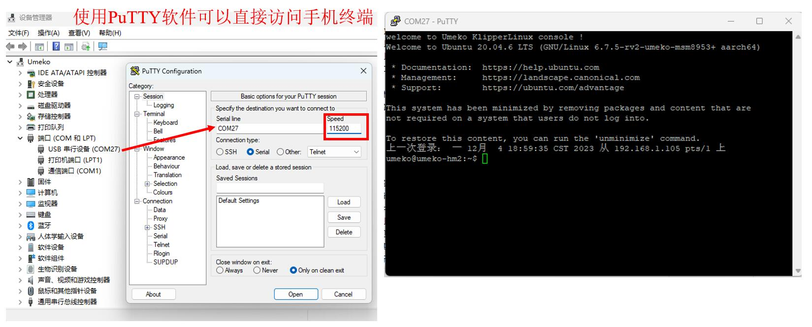
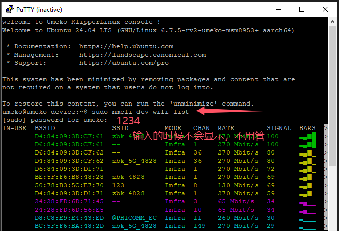
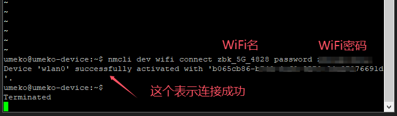

# WIFI刷不出来命令行连接


**解决办法：通过数据线，在串口命令行连接WiFi**

[视频教程 https://www.bilibili.com/video/BV1skNoeuEcE/](https://www.bilibili.com/video/BV1skNoeuEcE/)

1. 连接数据线到电脑

(带hub板的把跳线帽全部拔掉，然后接12-24v电源开机)



2. 在电脑设备管理中查看串口号



3. 安装putty并通过它连接命令行

[putty官方最新版下载链接：https://www.chiark.greenend.org.uk/~sgtatham/putty/latest.html](https://www.chiark.greenend.org.uk/~sgtatham/putty/latest.html)

我下载备份阿里云盘链接：

putty
https://www.alipan.com/s/ZfeDHSdLJ9P
提取码: 7b0e




4. 查看可连接的WiFi

```shell
sudo nmcli dev wifi list
```



5. 连接WiFi

```shell
# 替换wifi_name wifi_passwd为你自己的wifi名和密码
sudo nmcli dev wifi connect wifi_name password wifi_passwd
```

