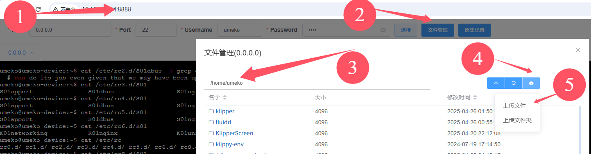
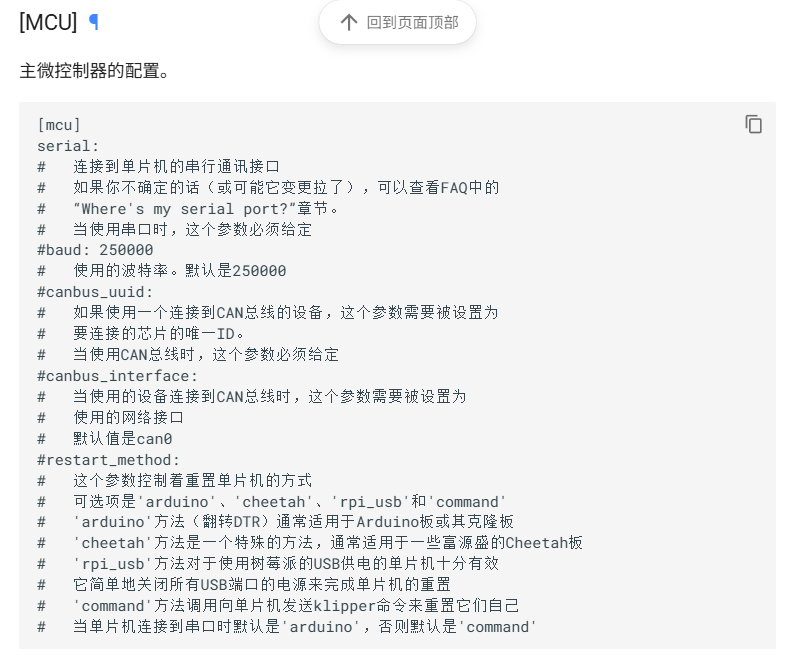

# 带U2C的hub板使用主板桥接

## 1. 启用多can自动启动

### 1.1. 简述

用来解决多can的问题，比如使用带can的hub板，同时又想主板桥接can，就需要用到这个文件。(最多支持6个can网络自动启动，can0-can5)

使用目录中的`auto_can_up.sh`替换`/home/auto_can_up.sh`文件即可

[auto_can_up.sh](./auto_can_up.sh)

### 1.2. 步骤

1. 上传`auto_can_up.sh`文件



2. 备份原来的`auto_can_up.sh`文件

```
sudo cp /home/auto_can_up.sh /home/auto_can_up.sh.bak
```

3. 替换原来的`auto_can_up.sh`文件

```
sudo cp -f /home/umeko/auto_can_up.sh /home/auto_can_up.sh
```

4. 添加执行权限

```
sudo chmod a+x /home/auto_can_up.sh
```

5. 断电重启

## 2. klipper配置

### 2.1. 主板刷can固件

具体可参考主板说明书

**注意can频率设置，要设置一样频率才能通讯，不然回识别不到can板**

### 2.2. 正确连接线路

can网络设备是并联，也就是【L接L，H接H】，推荐屏蔽线。

### 2.3. 在kilpper配置文件中设置canbusid和canbus接口

官网配置参考地址：

https://www.klipper3d.org/zh/Config_Reference.html#mcu



**重点指定canbus_interface**

示例：

```
[mcu]
canbus_uuid: xxxxxxxx
#   如果使用一个连接到CAN总线的设备，这个参数需要被设置为
#   要连接的芯片的唯一ID。
#   当使用CAN总线时，这个参数必须给定
canbus_interface: can1
#   当使用的设备连接到CAN总线时，这个参数需要被设置为
#   使用的网络接口
#   默认值是can0
```


### 2.4. can板配置

示例

```
[mcu ABC_CAN]
canbus_uuid: xxxxxxxxabc
#   如果使用一个连接到CAN总线的设备，这个参数需要被设置为
#   要连接的芯片的唯一ID。
#   当使用CAN总线时，这个参数必须给定
canbus_interface: can1
#   当使用的设备连接到CAN总线时，这个参数需要被设置为
#   使用的网络接口
#   默认值是can0
```