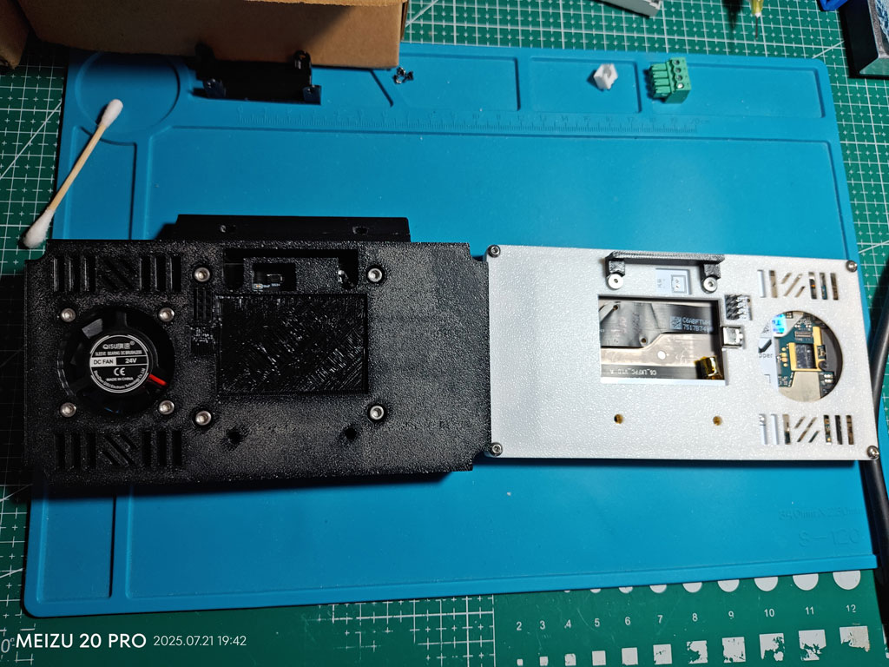

# 方形-voron可用

## 1. 安装方式

## 2. 螺丝目录

|             型号              | 数量 |  安装方式  |      说明       |
| ----------------------------- | ---- | --------- | --------------- |
| 圆头(平头也可)内六角`M3*14`螺丝 | 4    | 一体、分体 | 风扇固定螺丝     |
| 六角M3螺母                     | 4    | 一体、分体 | 风扇固定螺母     |
| 杯头内六角`M5*8-10`螺丝         | 2    | 一体、分体 | 支架型材固定螺丝 |
| 欧标T型(滑块)M5螺母             | 2    | 一体、分体 | 支架型材固定螺母 |
| 杯头内六角`M3*14`螺丝           | 4    | 一体       | 后盖前盖固定螺丝 |
| 杯头内六角`M3*8`螺丝            | 4    | 分体       | 后盖支架固定螺丝 |
| 杯头内六角`M3*8`螺丝            | 4    | 分体       | 后盖前盖固定螺丝 |
| 杯头内六角`M3*14`螺丝           | 4    | 分体       | 支架hub固定螺丝  |
| 六角M3螺母                     | 4    | 分体       | 支架hub固定螺母  |

> 根据安装方式选配螺丝，【一体、分体】表示都需要。
>
> 杯头螺丝可用用圆头或平头进行替换。

## 3. 打印文件盘说明

## 4. 效果图

