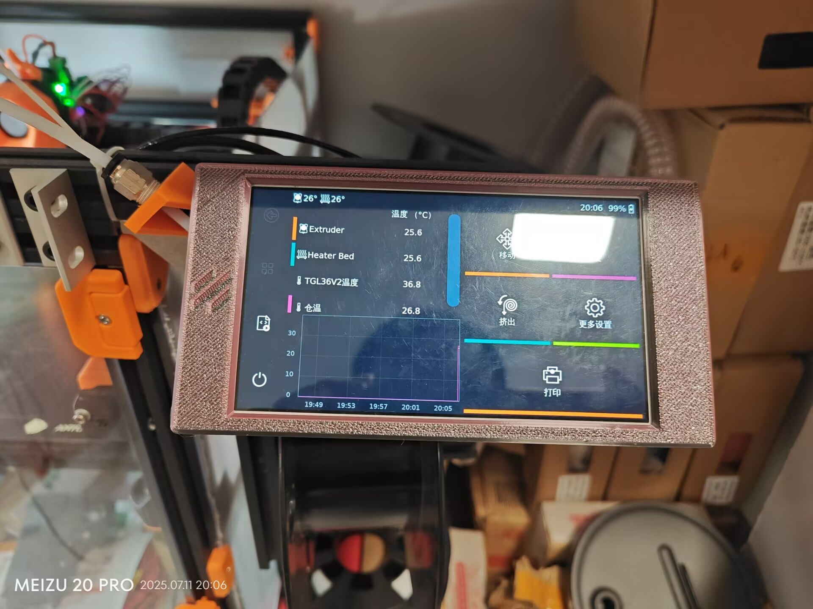
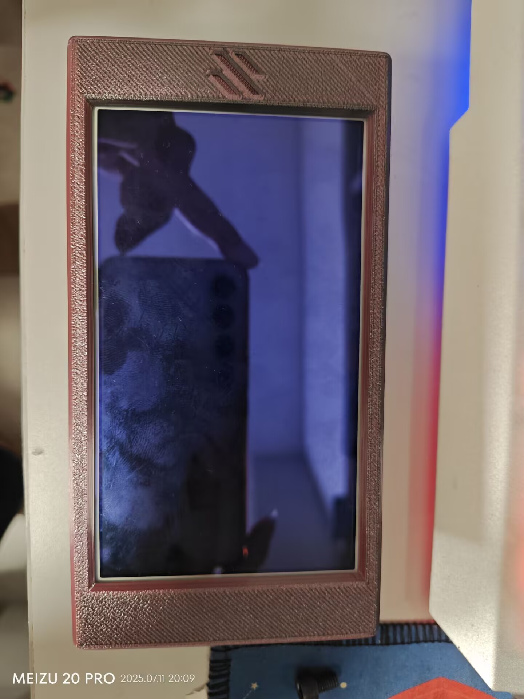
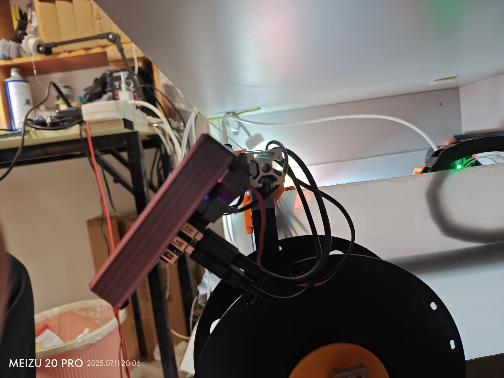
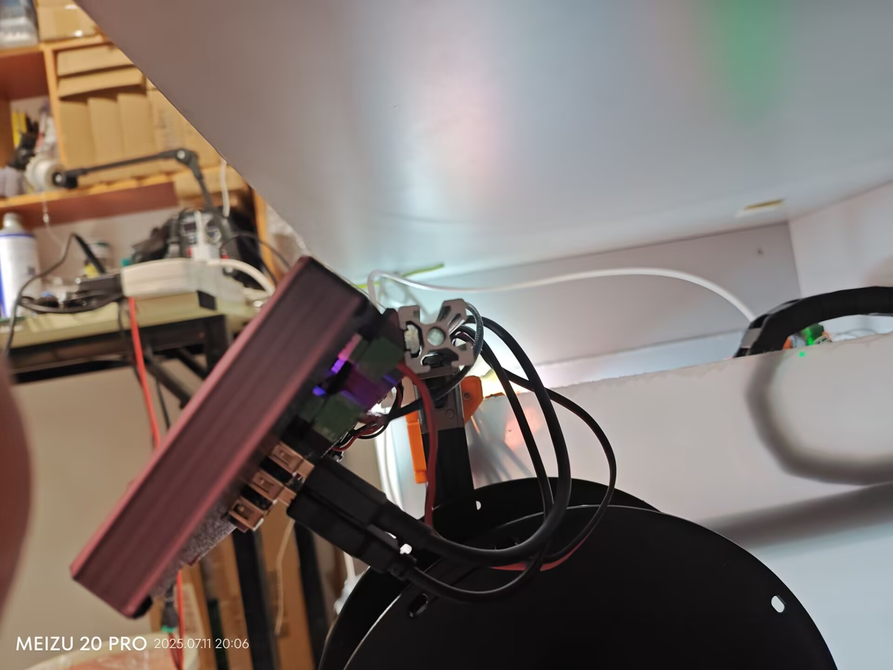
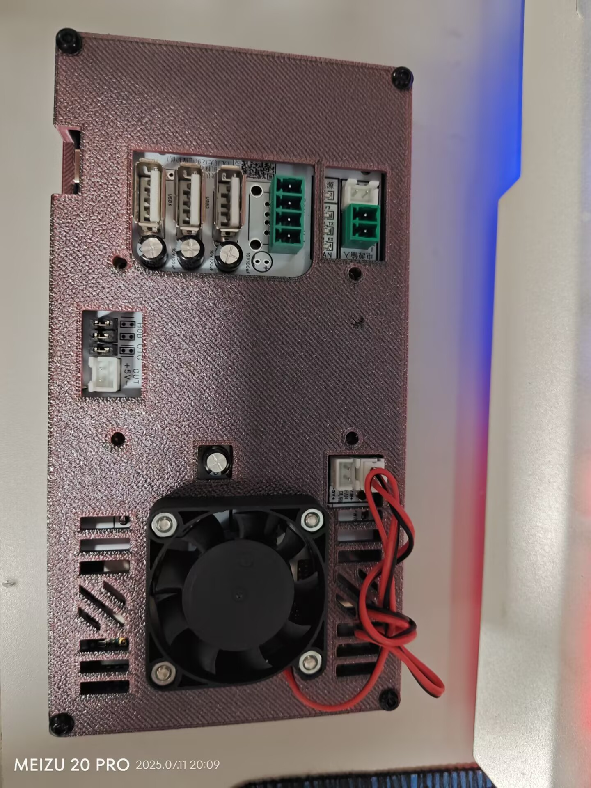
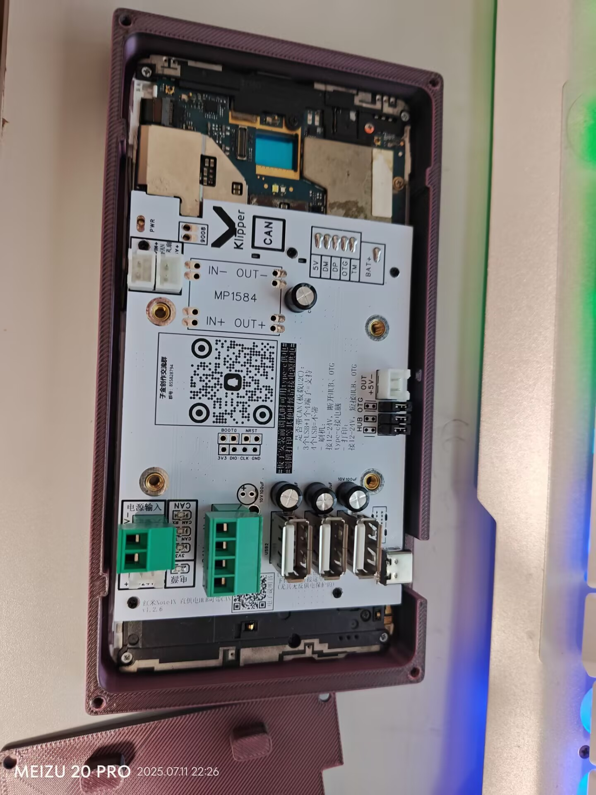
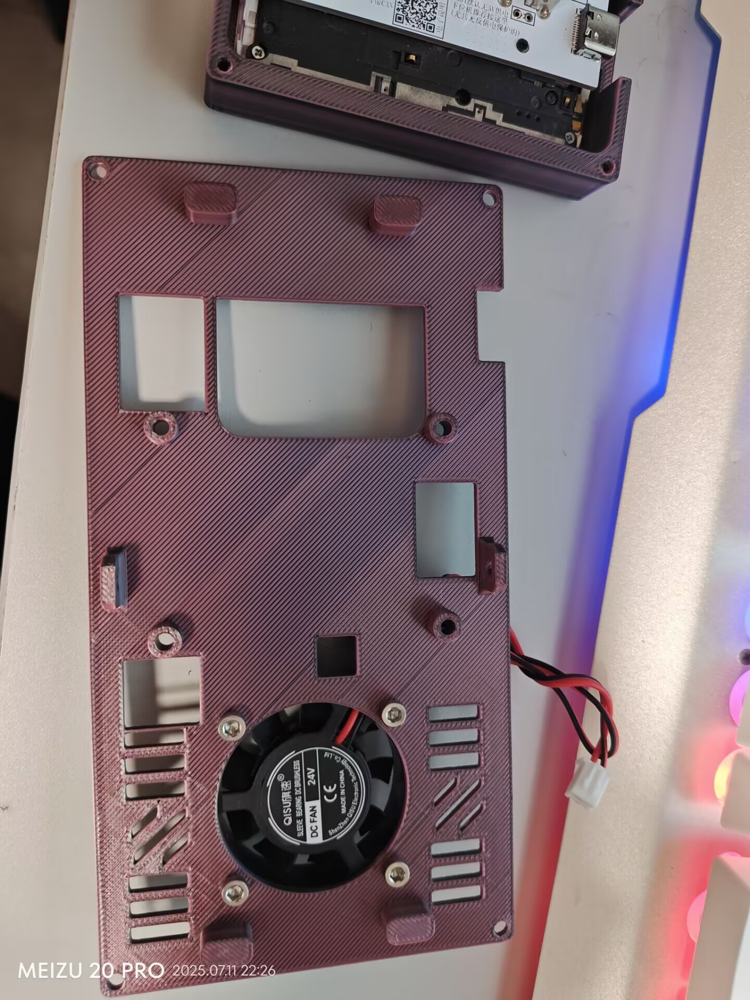
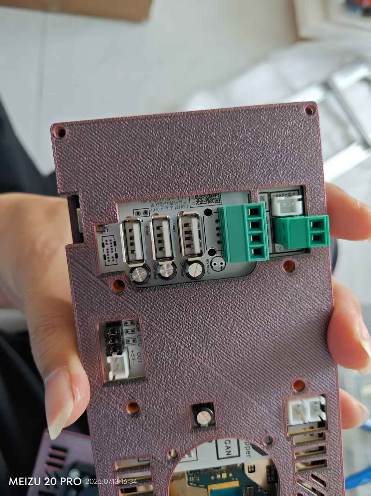

# 方形-voron可用

## 1. 安装方式

## 2. 螺丝目录

|              型号               | 数量 |       说明        |
| ------------------------------- | ---- | ---------------- |
| 圆头内六角`M3*8-12`自攻螺丝       | 4    | 前后盖固定四角螺丝 |
| 沉头内六角`M3*8`自攻螺丝          | 2    | 前后盖固定侧面螺丝 |
| 杯头内六角`M3*12`螺丝            | 4    | 支架手机固定螺丝   |
| 杯头(圆头、平头)内六角`M3*14`螺丝 | 4    | 风扇固定螺丝       |
| 六角M3螺母                       | 4    | 风扇固定螺母       |
| 杯头内六角`M5*8-10`螺丝          | 2    | 支架型材固定螺丝   |
| 欧标T型(滑块)M5螺母              | 2    | 支架型材固定螺母   |

## 3. 效果图

