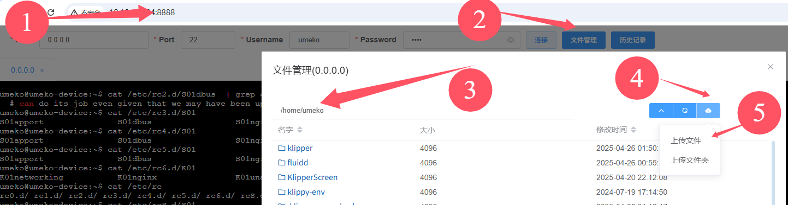

# 说明

## 1. 简述

用来解决多can的问题，比如使用带can的hub板，同时又想主板桥接can，就需要用到这个文件。(最多支持6个can，can0-can5)

使用目录中的`auto_can_up.sh`替换`/home/auto_can_up.sh`文件即可

## 2. 步骤

1. 上传`auto_can_up.sh`文件



2. 备份原来的`auto_can_up.sh`文件

```
sudo cp /home/auto_can_up.sh /home/auto_can_up.sh.bak
```

3. 替换原来的`auto_can_up.sh`文件

```
sudo cp -f /home/umeko/auto_can_up.sh /home/auto_can_up.sh
```

4. 断电重启